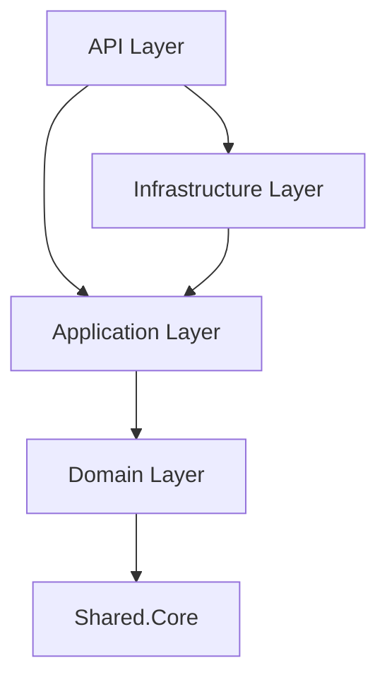

# clean-architecture-monorepo
This is a boilerplate monorepo demonstrating clean architecture principles in scalable microservices. Built to showcase code style, repo organization, and contributor-safe design.

## ⚖️ Philosophy
This repository is not a textbook implementation of Clean Architecture or Domain‑Driven Design.
Instead, it represents my take on these principles, adapted for a contributor‑safe, scalable microservice ecosystem.

The goal is not dogmatic purity, but pragmatic clarity:
- Clean separation of concerns without over‑engineering.
- Domain models that reflect business reality, but remain approachable for new contributors.
- Shared libraries treated as governed contracts, evolved only with consensus.
- Explicit conventions (naming, enums, audit columns, ports) to reduce onboarding friction.

Think of this repo as a living template: it borrows from established theory, but bends toward practical onboarding, maintainability, and team safety.

## 🚧 Work in Progress
This repository is a work in progress and is not yet complete.
It represents an evolving exploration of Clean Architecture and Domain‑Driven Design in a monorepo context.

Expect ongoing changes as conventions are refined, new services are added, and contributor‑safe patterns are improved.
Feedback and contributions are welcome — the goal is to grow this into a robust, onboarding‑friendly ecosystem over time.

## 🔎 Overview
This repository provides a foundation for building scalable microservices using Clean Architecture. It emphasizes:
- Separation of concerns
- Explicit contracts between layers
- Contributor‑safe onboarding
- Consistent repo hygiene and naming conventions

## 🏗 Architecture
Each microservice follows this layered approach, ensuring clarity and testability.
- Domain Layer → Core business rules and entities
- Application Layer → Use cases, orchestration, and service logic
- Infrastructure Layer → Persistence
- API Layer → REST entry points

## 🔗 Project Dependencies

